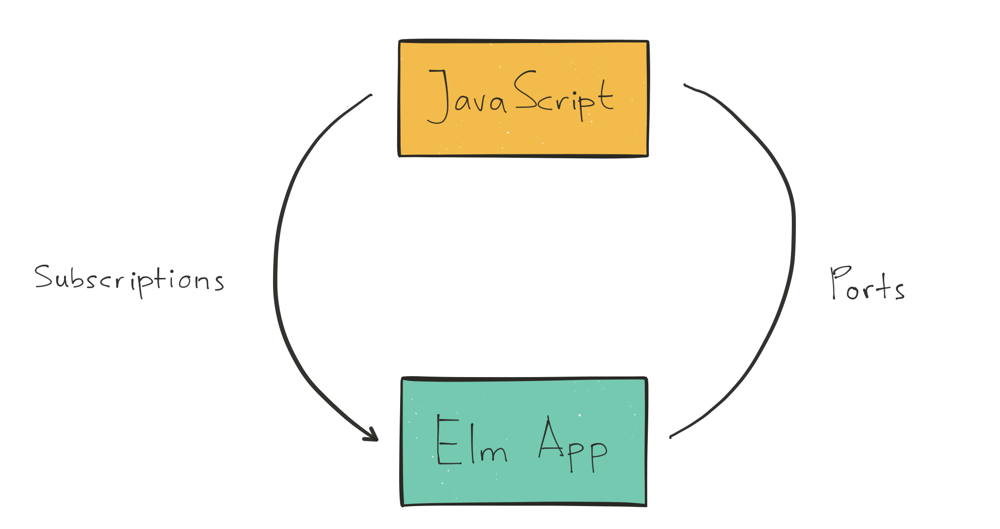
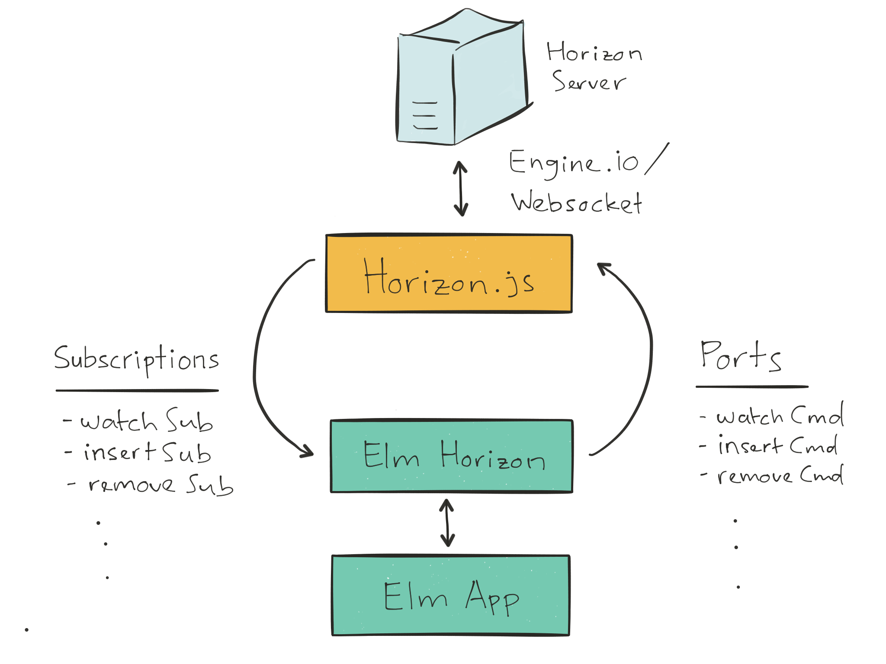
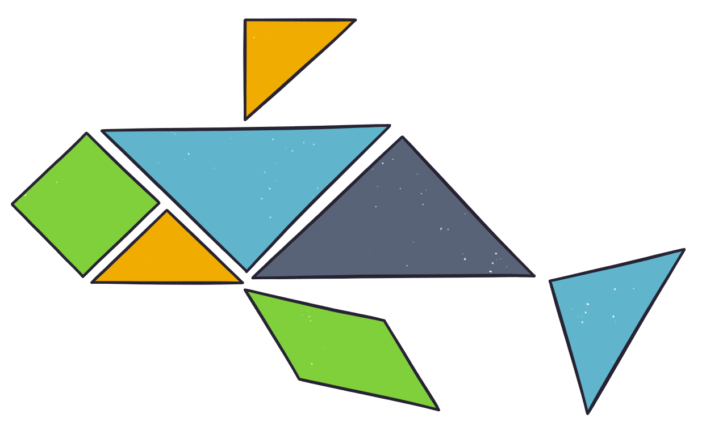

class: title middle center
# 0-60 in 15 Minutes
## Building a Realtime App With Elm and Horizon.js

.logo[.elm[]]

- Abadi Kurniawan
- Senior Developer @Engage Software


.social-media[
.twitter[.logo[] [@abadikurniawan](https://twitter/abadikurniawan)]
.github[.logo[] [abadi199](https://github/abadi199)]
]

???
Hi, My name is Abadi Kurniawan, and today I will be talking about building a realtime app with elm and horizon js.
I'm a senior software developer at a st. louis based company called engage software, where I've been using elm in production for about 7 months.

Today, I will be talking about using elm with horizon js to build a realtime app.

We are all here because we love elm. Or at least you've interested in elm. I personally love elm. Elm is a great language and really fun to use.
It has pretty much solved my JavaScript fatigure, I don't need to pick from millions of different library, tools, and framework. I just need to choose Elm.
Now, I wish I can have the same experience in the backend, but until we can use Elm in the backend, we will have to settle with whatever languages available to use.

And then I found horizon.
---
class: horizon center middle
#  What is Horizon?

Horizon is realtime, open source backend for JavaScript apps

[https://horizon.io](https://horizon.io)

.logo[.horizon[]]

???
Horizon is an open-source development platform for building realtime, scalable web apps. 
It's built on top of Rethink DB by the Rethink DB team, and runs on node.js.

If you're familiar with Firebase, horizon is similar to Firebase, but it's open source, and you can host your own horizon server on your own server.

In this talk, I'm still using horizon version 1, and horizon version 2 was recently released a few weeks ago. 
But all the API that I'll be talking about are still valid for version 2. In v2, they've added new features such as query aggregation, 
auth0 integration, and support for native websocket.
 
---
class: horizon api center  
## Horizon API
- Authentication

???
Horizon provides several API. The first on is 
---
class: horizon api center  
## Horizon API
- Authentication
- Users & Groups

???
---
class: horizon api center  
## Horizon API
- Authentication
- Users & Groups
- Permissions

???
---
class: horizon api center  
## Horizon API
- Authentication
- Users & Groups
- Permissions
- Collection API

???
---
class: horizon api center  
## Horizon API
- Authentication
- Users & Groups
- Permissions
- Collection API
- Horizon API

???
---
class: horizon api final center 
## Horizon API
- Authentication
- Users & Groups
- Permissions
- **Collection API**
- Horizon API

???
---
class: horizon center
## Collection API

.table.medium.three-columns[
| Read | Write  | Modifiers 
|:----:|:------:|:--------:|
| `fetch` | `remove` | `above`
| `watch` | `removeAll`| `below`
| | `insert` | `find`
| | `replace` | `findAll`
| | `store` | `limit`
| | `update` | `order`
| | `upsert` |
]

???
Horizon provides several API that you can use. 

---
class: horizon
## Horizon.js - Example
```javascript
var messages = new Horizon()('messages');
messages
    .findAll({from: 'elm'})
    .limit(5)
    .watch()
    .subscribe(data => { console.log(data); });

messages.store({from:'elm',msg:'Hello World!'});
// [{from:'elm',msg:'Hello World!'}]

messages.store({from:'elm',msg:'From Elm Conference'});
// [{from:'elm',msg:'Hello World!'},
// {from:'elm',msg:'From Elm Conference'}]

messages.store({from:'abadi',msg:'Just ignore me!'});
```

---
class: elm ports center middle
## Elm - Ports & Subscriptions

.diagram[.ports[]]

???

Horizon version 1 was implemented with engine.io, which is an implementation of transport-based cross-browser/cross-device bi-directional communication layer for socket.io.
So that rules out elm websocket from our options. 
---
class: elm elm-horizon center middle
## Elm-Horizon
.diagram[.elm-horizon[]]

---
class: elm center 
## Elm-Horizon
### Collection API


.table.wide.three-columns[
| Read           | Write              | Modifiers                | 
|:--------------:|:------------------:|:------------------------:|
| `watchCmd/Sub` | `removeCmd/Sub`    | `Above Json.Value`       |
| `fetchCmd/Sub` | `removeAllCmd/Sub` | `Below Json.Value`       |
|                | `insertCmd/Sub`    | `Find (List Json.Value)` |
|                | `replaceCmd/Sub`   | `FindAll Json.Value`     |
|                | `storeCmd/Sub`     | `Limit Int`              |
|                | `updateCmd/Sub`    | `Order String Direction` |
|                | `upsertCmd/Sub`    |                          |
]

---
class: elm
## watchCmd/Sub
```elm
watchCmd : String -> List Modifier -> Cmd msg
watchCmd collectionName modifiers = ...
   
watchSub : Decoder a -> (Result Error (List (Maybe a)) -> msg) -> Sub msg
watchSub decoder tagger = ...
```
#### Example 
```elm
subscriptions = watchSub messageDecoder NewMessage

init = ( initialModel
        , watchCmd "messages"
            [ FindAll <| encode { from = "Elm" }
            , Limit 5
            ]
        )
```
---
## insertCmd/Sub
```elm
insertCmd : String -> List Json.Value -> Cmd msg
insertCmd collectionName data = ...

insertSub : (Result Error () -> msg) -> Sub msg
insertSub resultTagger = ...
```
#### Example
```elm
update msg model = 
    case msg of
        Insert message -> 
            ( model, insertCmd "messages" [ encode message ] )

subscriptions = insertSub InsertResponse
```
---
## Modifiers
```elm
encodeModifier : Modifier -> Json.Value
encodeModifier modifier =
    case modifier of
        Limit number ->
            Encode.object 
                [ ( "modifier", Encode.string "limit" )
                , ( "value", Encode.int number ) 
                ]
```
#### Example
```bash
> encode <| Limit 100
{ modifier = "limit", value = 10 } : Json.Decode.Value

> encodeModifier <| Horizon.FindAll <| encode { from = "Elm" }
{ modifier = "findAll", value = { from = "Elm" } } : Json.Decode.Value
```
---
class: center middle
# Demo
### Simple Chat App

---
class: thanks center middle
# Thanks

.image[.elm-whale[]]

Source Code : [https://github.com/abadi199/elm-horizon](https://github.com/abadi199/elm-horizon)

Slide : [https://abadi199.github.com/elm-conf](https://abadi199.github.com/elm-conf)

