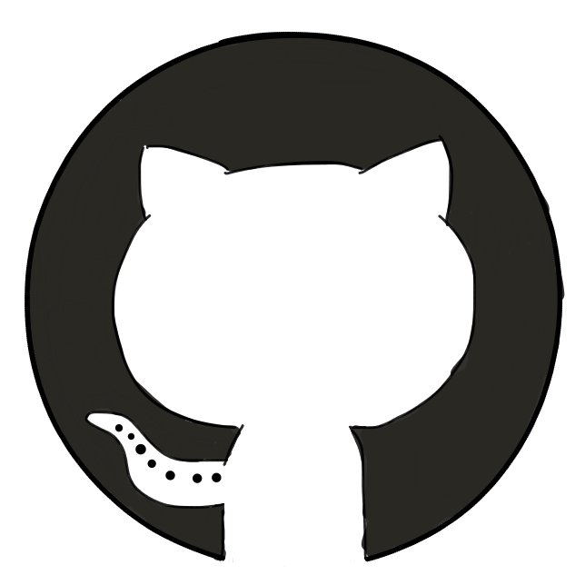

class: elm heart center middle
# I .image[.elm-heart[]] Elm
???
I'm gonna start this talk by saying I love elm. 

I think Elm is a great language and Elm is really fun to use. 

---
class: center middle
.image[.face[]]
???
I feel happy whenever I'm working on my front end, and writing Elm. 
But there is a downside of Elm
---
class: center middle
.image[.face[]]

???
I feel sad whenever I have to work on my backend code.
I wish I can use Elm everywhere. But since we can't really use Elm in the server yet, so I'm stuck with my backend language.

But what if there's another option. 
Maybe you don't have to write any backend code at all?
---
class: center middle
.image[.face[]]
???
What if I replace my backend with Horizon?
---
class: center middle
.image[.face[]]
???
Maybe I can turn this sad face into happy face again.
---
class: title middle center
# 0-60 in 15 Minutes
## Building a Realtime App With Elm and Horizon.js

.logo[.elm[]]

- Abadi Kurniawan
- Web Developer @Engage Software

.social-media[
.twitter[.logo[] [@abadikurniawan](https://twitter/abadikurniawan)]
.github[.logo[] [abadi199](https://github/abadi199)]
]


???
Hi everyone, My name is Abadi Kurniawan.
I'm a web developer at engage software, where I've been using elm in production for about 7 months.

Today, I will be talking about using elm with horizon js to build a realtime app.
---

class: horizon center middle
# What is Horizon?

.logo[.horizon[]]

???
So, what is horizon?

---
class: horizon center middle
### Horizon is a realtime, open source backend for JavaScript apps

[https://horizon.io](https://horizon.io)

???
Horizon is an open-source development platform for building realtime, scalable web apps. 
It's built on top of RethinkDB and runs on node.js.

You can run horizon on your local machine, or on their cloud service, which is still in private beta at the moment. 

With horizon, you can build a realtime javascript application without writing any backend code. 
---
class: horizon api center
## Horizon API
- Authentication
- Users & Groups
- Permissions
- Collection API
- Horizon API

???
Horizon provides several API.
There's authentication, users and groups, permission, collection API and Horizon API.
---
class: horizon api final center 
## Horizon API
- Authentication
- Users & Groups
- Permissions
- **Collection API**
- Horizon API

???
In this talk, I'm only going to cover Collection API.
---
class: horizon center collection write 
## Collection API

.table.medium.three-columns[
| Write       | Read    | Modifiers| 
|:-----------:|:-------:|:--------:|
| `remove`    | `fetch` | `above`
| `removeAll` | `watch` | `below`
| `insert`    |         | `find`
| `replace`   |         | `findAll`
| `store`     |         | `limit`
| `update`    |         | `order`
| `upsert`    |         |
]

???
What is collection?
In horizon, a Collection is an object represents a group of related documents, and it's backed by RethinkDB table. 
Collection API is a way for you to read and write into a collection, or RethinkDB table.

I'm grouping this API into 3 categories. This is not an official classification by Horizon. 
I just find it helpful to think about this API this way and how I can implement this in Elm.

The first category is the Write operations, which consists of remove, removeAll, insert, replace, store, update, and upsert. 
These are all operations that do some sort of writing/updating to the database. 

---
class: horizon center collection read
## Collection API

.table.medium.three-columns[
| Write       | Read    | Modifiers| 
|:-----------:|:-------:|:--------:|
| `remove`    | `fetch` | `above`
| `removeAll` | `watch` | `below`
| `insert`    |         | `find`
| `replace`   |         | `findAll`
| `store`     |         | `limit`
| `update`    |         | `order`
| `upsert`    |         |
]

???
The second category is Read operation, which contains fetch and watch. Both operations are use to read data from your collection, 
the difference is that with fetch, you only get the data once, similar to how select in sql works, while watch is you create a subscription to the data 
that you're interested in, and whenever there's some changes to these data, you will receive a new data.
---
class: horizon center collection modifiers
## Collection API

.table.medium.three-columns[
| Write       | Read    | Modifiers | 
|:-----------:|:-------:|:---------:|
| `remove`    | `fetch` | `above`
| `removeAll` | `watch` | `below`
| `insert`    |         | `find`
| `replace`   |         | `findAll`
| `store`     |         | `limit`
| `update`    |         | `order`
| `upsert`    |         |
]
???
The last category is Modifiers. This is the interesting one. So these are all operations that will "modify" your read operation. 
the way you use these modifiers operations are by applying them to your read operations. SO in a way, it modifies your read operations.

Above, below, find, and findAll are some kind of filtering modifiers.

Limit: will limit the number of data your want to get. 

And order, will sort the results based on certain fields. 
---
class: horizon
## Horizon.js - Example
```javascript
var messages = new Horizon()('chat_messages');
messages
    .findAll({from: 'elmo'})
    .limit(5)
    .watch()
    .subscribe(data => { console.log(data); });

messages.insert({ from: 'elmo', msg: 'Hello World!' });
// [{from:'elm',msg:'Hello World!'}]

messages.insert({ from: 'elmo', msg: 'From Elm Conference' });
// [{from:'elm',msg:'Hello World!'},
// {from:'elm',msg:'From Elm Conference'}]

messages.insert({ from: 'abadi', msg: 'Just ignore me!' });
```
???
Let's say we want to build a silly chat app.
Here's a sample code of what my chat app could look like.

First, you want to create a connection to horizon server, 

and you specify the name of the collection you want to work on, in this case it's "chat_messages".

then you want to subscribe to that collection using watch, but let's just say we only care about all messages from a user called "elmo"
so we use the findAll modifiers, and we only want to get last 5 messages, so we use another modifiers called limit, and passed in 5 as the argument.

and then we subscribe to that data, and provide a callback to that subscription, which in this case we're just going to print the data to console.log.

and then next, we insert a new chat message to the collection. and since this message is from the user "elmo", 

our callback is going to get called, and we will see the message in our console.log.

and then we send another message from elmo, and will will see both messages in our console log, first first one, and the new one.

and then we insert another message, but this time, it's from the user abadi. This time we will not going to see anything in our console.log, since we only subscribe to messages from elmo.

---
class: elm center middle
# Elm-Horizon
.logo[.elm[]]
.logo[.horizon[]]
???
OK, cool, so we can write an app in javascript. But that's not what we want. We want to write Elm code, not javascript code.

So how can we use horizon with elm in a nice way, so we don't have to write any javascript code, and just write Elm code. 

So we know Horizon provides a javascript client library, 

and in Elm, in order to communicate to javascript, we will have to use Ports and Subscriptions.  
---
class: elm ports center middle
## Elm - Ports & Subscriptions

.diagram[.ports[]]

???
Ok, so what is Ports and Subscriptions

Ports and Subscriptions are a way for elm to interop with javascripts. 

It's basically a message passing between elm and javascript.

Similar to how you do message passing between client and server. But instead, it's between your elm application and some javascript code.

For sending data out from elm to javascript, we use ports, and for receiving data in from javascript to elm, we use subscriptions. 

and you can only send and receive a certain type of data, like string, integer, records, 

or if you want to send data with arbitrary shape, you can use json values. 
---
class: elm elm-horizon center middle
## Elm-Horizon
.diagram[.elm-horizon[]]

???
Now, let's see how we we can use ports and subscription with Horizon.

 So we'll use port to send json values out to horizon javascript client, and then we receive the json values back in using subscriptions. 
 
Each read and write operations that we saw previously in the Collection API, will have a pair of ports and subscriptions. 

In the case of read operation, which is watch and fetch, 

will send out the information about the query via port, in this case the name of the collection,
and the modifiers.

and then we will receive the actual collection data via the subscription.

In the case of write operation, we send the data that we want to write to the collection via port,

and then we will get the status of that operation via subscriptions.

and then the horizon javascript library will then handles all the network communication with the server.
---
class: elm center 
## Elm-Horizon
### Collection API

.table.wide.three-columns[
| Write              | Read           | Modifiers                | 
|:------------------:|:--------------:|:------------------------:|
| `removeCmd/Sub`    | `watchCmd/Sub` | `Above Json.Value`       |
| `removeAllCmd/Sub` | `fetchCmd/Sub` | `Below Json.Value`       |
| `insertCmd/Sub`    |                | `Find Json.Value` |
| `replaceCmd/Sub`   |                | `FindAll (List Json.Value`)     |
| `storeCmd/Sub`     |                | `Limit Int`              |
| `updateCmd/Sub`    |                | `Order String Direction` |
| `upsertCmd/Sub`    |                |                          |
]
???
So, here are those 3 categories of Collection API look like in Elm. 

We have pairs of command and subscription functions for each read and write operations. 

The command is for sending data or queries out to horizon js, 

and the subscription is to receive the results, or data back from horizon js.

The modifiers is a little bit different. Here, modifiers are implemented as union types
 
with each constructor requires data relevant to what the modifier is trying to do. 

Above, Below, Find, and FindAll constructors require Json value which is the criteria of the filter. 

Limit constructor requires an integer, which is the number of data you want to get.

and Order contructor requires a String, which is the name of the field you want to sort by,

and a union types called Direction, that can be either Descending or Ascending.
---
#### Example
```elm
subscriptions = 
    Sub.batch 
        [ watchSub chatMessageDecoder NewChatMessage
        , insertSub InsertResponse
        ]

update msg model =
    case msg of
        NewChatMessage chatMessages ->
            let _ = Debug.log "Chat Message" chatMessages
            ...

init = 
    ...
    Cmd.batch 
        [ watchCmd "chat_messages"
            [ FindAll <| [ encode { from = "elmo" } ]
            , Limit 5
            ]
        , insertCmd "chat_messages" [ encode { from = "elmo", msg = "Hello World!" } ] 
        , insertCmd "chat_messages" [ encode { from = "elmo", msg = "From Elm Conference" } ] 
        , insertCmd "chat_messages" [ encode { from = "abadi", msg = "Just ignore me!" } ]
        ]
    ...
```
???
Here's what the previous simple chat app will look like in Elm.

We'll subscribe to watch subscriptions, that will give us all the data from our watch command, 

and we also subscribe to insert subscription that will give us status of all our insert command.

and on our update function, we'll just do Debug.log whenever there's a new chat message. 

On the init function, we will do a batch of watch command and insert commands.

On the watch command, we'll pass in the collection name and a List of modifiers, 

in this case a FindAll with the filter criterias as a list of Json values, 

and Limit of 5 to limit the data to only 5 rows. 

and then we'll call insert command with the encoded values of the chat message.
---
class: center middle
# Demo
### Simple Chat App

???
And I'm gonna do a demo of what we can build with elm and horizon.

This simple chat app was written purely in Elm, using the Elm-Horizon library. 

There are some javascript code in the Elm-Horizon library, 

but the chat application is written only using elm, no javascript, and no backend code.
---
class: conclusion center middle
#.logo[.elm[]] + .logo[.horizon[]] = .logo[.face[]]
???
So in conclusion, using elm with horizon makes me happy all the time.
---
class: thanks center middle
# Thanks

.image[.elm-whale[]]

#### Source Code 
[https://github.com/abadi199/elm-horizon](https://github.com/abadi199/elm-horizon)

#### Slide 
[https://abadi199.github.com/elm-conf](https://abadi199.github.com/elm-conf)
???
That's all I have today.
You can check out the source code for the elm horizon on my github repo, the code for the chat app is in the example folder.
and you can access my slide on my github page, at abadi199.github.com/elm-conf.

Thank you, and enjoy the rest of your conference.