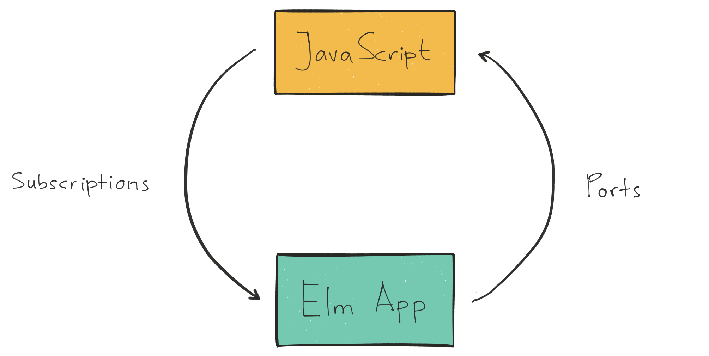

class: title middle center
# 0-60 in 15 Minutes
## Building a Realtime App With Elm and Horizon.js

.logo[.elm[]]

- Abadi Kurniawan
- Senior Developer @Engage Software


.social-media[
.twitter[.logo[] [@abadikurniawan](https://twitter/abadikurniawan)]
.github[.logo[] [abadi199](https://github/abadi199)]
]

???
Hi, My name is Abadi Kurniawan, and today I will be talking about building a realtime app with elm and horizon js.
I'm a senior software developer at a st. louis based company called engage software, where I've been using elm in production for about 7 months.

Today, I will be talking about using elm with horizon js to build a realtime app.

We are all here because we love elm. Or at least you've interested in elm. I personally love elm. Elm is a great language and really fun to use.
It has pretty much solved my JavaScript fatigure, I don't need to pick from millions of different library, tools, and framework. I just need to choose Elm.
Now, I wish I can have the same experience in the backend, but until we can use Elm in the backend, we will have to settle with whatever languages available to use.

And then I found horizon.
---
class: horizon center middle
#  What is Horizon?

Horizon is realtime, open source backend for JavaScript apps

[https://horizon.io](https://horizon.io)

.logo[.horizon[]]

???
Horizon is an open-source development platform for building realtime, scalable web apps. 
It's built on top of Rethink DB by the Rethink DB team, and runs on node.js.

If you're familiar with Firebase, horizon is similar to Firebase, but it's open source, and you can host your own horizon server on your own server.

In this talk, I'm still using horizon version 1, and horizon version 2 was recently released a few weeks ago. 
But all the API that I'll be talking about are still valid for version 2. In v2, they've added new features such as query aggregation, 
auth0 integration, and support for native websocket.
 
---
class: horizon api center  
## Horizon API
- Authentication

???
Horizon provides several API. The first on is authentication, they provides a way for your app to authenticate user with this API.
---
class: horizon api center  
## Horizon API
- Authentication
- Users & Groups

???
and then Users & Groups, which is how horizon manage the users and groups in their system when you use their authentication API. 
---
class: horizon api center  
## Horizon API
- Authentication
- Users & Groups
- Permissions

???
and then we have Permissions API, which is how you can set the permissions of which users will have access to which data.
---
class: horizon api center  
## Horizon API
- Authentication
- Users & Groups
- Permissions
- Collection API

???
the next one is Collection API. This API is how you create, read, update, and delete documents in your database.
---
class: horizon api center  
## Horizon API
- Authentication
- Users & Groups
- Permissions
- Collection API
- Horizon API

???
and the last one is Horizon API, which is the API to manage the connection to the horizon server itself, such as creating connection, error handling, and so on.
---
class: horizon api final center 
## Horizon API
- Authentication
- Users & Groups
- Permissions
- **Collection API**
- Horizon API

???
In this talk, I will be focusing on the Collection API.
---
class: horizon center collection write 
## Collection API

.table.medium.three-columns[
| Write       | Read    | Modifiers| 
|:-----------:|:-------:|:--------:|
| `remove`    | `fetch` | `above`
| `removeAll` | `watch` | `below`
| `insert`    |         | `find`
| `replace`   |         | `findAll`
| `store`     |         | `limit`
| `update`    |         | `order`
| `upsert`    |         |
]

???
In horizon, a Collection is an object represents a group of related documents, and it's backed by RethinkDB table. 
Collection API is a way for you to read and write into a collection, or RethinkDB table.
Now, I classified this API into 3 categories. This is not an official classification by Horizon. But I found it helpful when I designed 
my library that wrap this API in Elm, which hopefully you'll be able to see after this talk.

The first category is the Write methods, which consists of remove, removeAll, insert, replace, store, update, and upsert. These are all methods that do some sort of writing/updating of the database. 

---
class: horizon center collection read
## Collection API

.table.medium.three-columns[
| Write       | Read    | Modifiers| 
|:-----------:|:-------:|:--------:|
| `remove`    | `fetch` | `above`
| `removeAll` | `watch` | `below`
| `insert`    |         | `find`
| `replace`   |         | `findAll`
| `store`     |         | `limit`
| `update`    |         | `order`
| `upsert`    |         |
]

???
The second category is Read, which contains fetch and watch. Both methods are use to read data from your collection, 
the difference is that with fetch, you only read the data once, similar to select in sql, and watch, is you create a subscription to this data 
that you're interested in. So whenever there's any changes to this set of data, you will receive a new data.
---
class: horizon center collection modifiers
## Collection API

.table.medium.three-columns[
| Write       | Read    | Modifiers | 
|:-----------:|:-------:|:---------:|
| `remove`    | `fetch` | `above`
| `removeAll` | `watch` | `below`
| `insert`    |         | `find`
| `replace`   |         | `findAll`
| `store`     |         | `limit`
| `update`    |         | `order`
| `upsert`    |         |
]
???
And the last category is Modifiers. This is the interesting one. So this are all methods that "modify" your read methods. We have above and below methods which will restrict the results to values that are above or below some certain values. And then we have find and findAll that will restrict your results that matches certain values. and then we have limit that limit the number of data your want to get. And the last one is order, which will sort the results based on certain field. You use these modifiers methods with the read methods, to modify the results that you'll get back from horizon.
---
class: horizon
## Horizon.js - Example
```javascript
var messages = new Horizon()('chat_messages');
messages
    .findAll({from: 'elm'})
    .limit(5)
    .watch()
    .subscribe(data => { console.log(data); });

messages.store({ from: 'elm', msg: 'Hello World!' });
// [{from:'elm',msg:'Hello World!'}]

messages.store({ from: 'elm', msg: 'From Elm Conference' });
// [{from:'elm',msg:'Hello World!'},
// {from:'elm',msg:'From Elm Conference'}]

messages.store({ from: 'abadi', msg: 'Just ignore me!' });
```

---
class: elm center middle
# Elm-Horizon
.logo[.elm[]]
.logo[.horizon[]]
???
Ok, since this is an Elm conference, so I'm gonna bring this back to elm. How can we use horizon with elm in a nice way, 
so we don't have to write any code other than Elm code. Of course, the best way is to use elm web socket to talk to horizon server, and perhaps implements a some library on top of elm web socket to make the api nicer. Unfortunatly, at least until today we can really do this yet. On version 1, horizon implemented their communication layer with engine.io, which they replaced with native web socket on version 2. But as far as I know, there's no public API available yet on how to do web socket communication directly. So, the second best way is to use their javascript client library, and we can use Ports and Subscriptions to communicate to this library.  
---
class: elm ports center middle
## Elm - Ports & Subscriptions

.diagram[.ports[]]

???
Ports and Subscriptions are a way for elm to interop with javascripts. It's basically a message passing between elm and javascript, just like message passing between elm app and server. For sending data from elm to javascript, we use ports, and for receiving data from javascript to elm, we use subscriptions.

---
class: elm elm-horizon center middle
## Elm-Horizon
.diagram[.elm-horizon[]]

???
Now, let's see how we we can use ports and subscription with Horizon. So we'll use port to send json values out to horizon javascript client, and then we receive the json values back in using subscriptions. Each read and write actions will have a pair of ports and subscriptions. 

In the case of read action, we will send the message of what queries we're interested in subscribing to via ports using watch command and fetch command, and then we will receive the data via the matching watch subscription and fetch subscription.

In the case of write action, we send the message of what to insert, remove, update, etc, via ports, and we use subscription to get the status of that command.
---
class: elm center 
## Elm-Horizon
### Collection API

.table.wide.three-columns[
| Read           | Write              | Modifiers                | 
|:--------------:|:------------------:|:------------------------:|
| `watchCmd/Sub` | `removeCmd/Sub`    | `Above Json.Value`       |
| `fetchCmd/Sub` | `removeAllCmd/Sub` | `Below Json.Value`       |
|                | `insertCmd/Sub`    | `Find (List Json.Value)` |
|                | `replaceCmd/Sub`   | `FindAll Json.Value`     |
|                | `storeCmd/Sub`     | `Limit Int`              |
|                | `updateCmd/Sub`    | `Order String Direction` |
|                | `upsertCmd/Sub`    |                          |
]
???
So, here are those 3 categories of Collection API look like in Elm-Horizon. We have pairs of command and subscription function for each read and write actions. What I found interesting is the modifiers. Here, I implemented modifiers as union types, with each values has some data relevant to what the modifier is trying to do. For example, Limit modifiers will have Int for the number of data you want to subscribe to.
---
class: elm
## watchCmd/Sub
```elm
watchCmd : String -> List Modifier -> Cmd msg
watchCmd collectionName modifiers = ...
   
watchSub : Decoder a -> (Result Error (List (Maybe a)) -> msg) -> Sub msg
watchSub decoder tagger = ...
```
#### Example 
```elm
subscriptions = watchSub messageDecoder NewMessage

init = ( initialModel
        , watchCmd "chat_messages"
            [ FindAll <| encode { from = "Elm" }
            , Limit 5
            ]
        )
```
---
## insertCmd/Sub
```elm
insertCmd : String -> List Json.Value -> Cmd msg
insertCmd collectionName data = ...

insertSub : (Result Error () -> msg) -> Sub msg
insertSub resultTagger = ...
```
#### Example
```elm
update msg model = 
    case msg of
        Insert message -> 
            ( model, insertCmd "chat_messages" [ encode message ] )

subscriptions = insertSub InsertResponse
```
---
## Modifiers
```elm
encodeModifier : Modifier -> Json.Value
encodeModifier modifier =
    case modifier of
        Limit number ->
            Encode.object 
                [ ( "modifier", Encode.string "limit" )
                , ( "value", Encode.int number ) 
                ]
```
#### Example
```bash
> encode <| Limit 100
{ modifier = "limit", value = 10 } : Json.Decode.Value

> encodeModifier <| Horizon.FindAll <| encode { from = "Elm" }
{ modifier = "findAll", value = { from = "Elm" } } : Json.Decode.Value
```
---
class: center middle
# Demo
### Simple Chat App

---
class: thanks center middle
# Thanks

.image[.elm-whale[]]

Source Code : [https://github.com/abadi199/elm-horizon](https://github.com/abadi199/elm-horizon)

Slide : [https://abadi199.github.com/elm-conf](https://abadi199.github.com/elm-conf)

